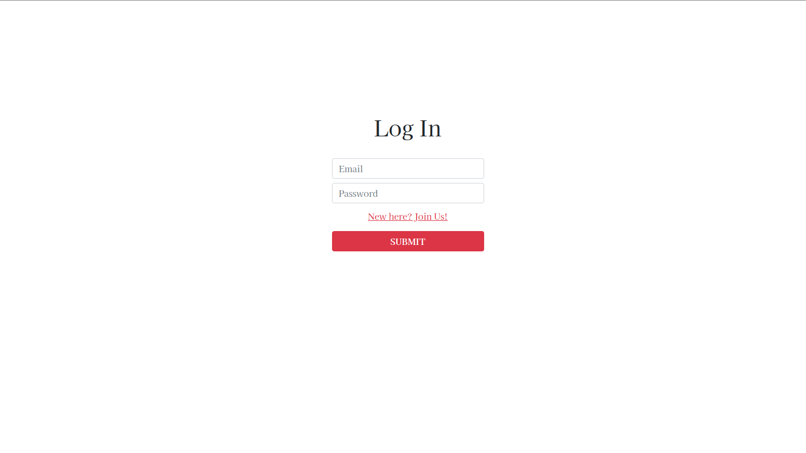

# The Economist Scraper Front-end

A simple web app, that counts with user authentication and displays the data scraped for the back-end part of this project.

- [Back-end of this project](https://github.com/helman101/economist-api)




## [Live Link](https://frosty-ptolemy-ca6fb6.netlify.app/)

- JavaScript
- REACT
- REDUX
- Jest
- Enzyme
- HTML
- CSS

## Getting Started

To set up a local copy of the project

- `git clone git@github.com:helman101/economist-app.git`
- `cd economist-app`
- `npm install`

### Run tests

- Go to your terminal
- Run ```npm test``` to run all the tests.

## Run locally

- Now you are ready to run a local server
- Go to your command line and put `npm start`
- Go to https://localhost:3000/
- Try it!!

## Author

👤 **Andres Ortegon**

- GitHub: [@helman101](https://github.com/helman101)
- Twitter: [@helman1011](https://twitter.com/Helman1011)
- LinkedIn: [Andres Ortegon](https://www.linkedin.com/in/helman101/)

## 🤝 Contributing

Contributions, issues, and feature requests are welcome!

## Show your support

Give a ⭐️ if you like this project!